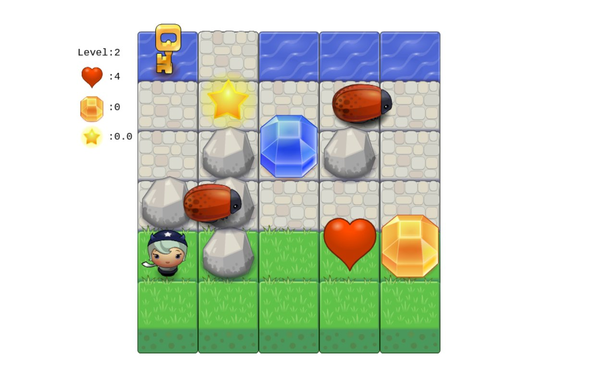

#frontend-nanodegree-arcade-game
##Author: Andrew Jongho Jung

##How to run this app:
Open index.html in a browser.

##How to play this game: 
The objective of this game is to obtain level key while avoid touching bugs and water.

- You progress one level when you obtain a level key, and the number of enemies will change
according to your level.
- Touching a bug or water will reduce your life by one. 
- Obtaining blue gem will create a stone block on the water where your player can step on.
- There will be rocks created randomly to block your movements. Obtain orange gem and step over
a rock to destroy it.
- A star will allow you to destroy all bugs that touches you for 5 seconds. 
- Obtain heart to increase your life. When you no longer have any life, the game will end.

#Enjoy!
